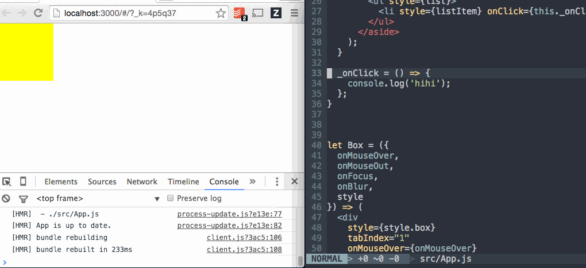

# React Style Toolbox

> Compose style behavior to leverage inline styles for your React Components



With React Style Toolbox, you define your styles as objects the way that you would for any kind of inline-style. However, as we look to support more behavior that is traditionally solved through CSS, like `:hover` states or media queries, styles tend to start looking more like this:

```js
const style = {
  box: {
    width: 100,
    height: 100,
    backgroundColor: 'black',
    ':hover': {
      backgroundColor: 'blue'
    },
    '@media screen and (min-width: 500px)': {
      backgroundColor: 'yellow',
      ':hover': {
        backgroundColor: 'red'
      }
    },
  }
};
```

We can leverage libraries like Radium to be able to support these kinds of values, however this limits our choices for what the actual values are that we can define in our styles.

For most use cases, the default CSS psuedoclasses will be appropriate. However, if we wanted to create higher abstractions like `:tapped` that make more sense for our application then we're out of luck.

## Usage

While working in the project, you can use the `Hover` component to add support for `:hover` to work on a style object. For example, you could do:

```js
import Hover from './components/Hover';

let Box = ({
  onMouseOver,
  onMouseOut,
  style
}) => (
  <div
    style={style.box}
    onMouseOver={onMouseOver}
    onMouseOut={onMouseOut}
  />
);

Box = Hover(Box, {
  box: {
    width: 100,
    height: 100,
    backgroundColor: 'black',
    ':hover': {
      backgroundColor: 'blue'
    }
  }
});
```

`Hover` in this case is just a Higher Order Component that peaks at the styles given to it as a second argument, extracts all the properties related to the key `:hover`, and then applies them when `Box` is hovered over. The hover behavior is defined by the `onMouseOver` and `onMouseOut` handlers that are applied to the Box component, and the `Hover` component will respond depending on what those listeners pass back to it.

Something that's interesting with this approach is since `Hover` is just a HoC acting as a function that takes in a style object and outputs a style object (with appropriate event handlers), then we can compose `Hover` with other style HoCs that we may define.

For example, we could add in `Focus` to the example above to support the `:focus` key and use it like in the following:

```js
import Hover from './components/Hover';
import Focus from './components/Focus';

let Box = ({
  onMouseOver,
  onMouseOut,
  onFocus,
  onBlur,
  style
}) => (
  <div
    style={style.box}
    tabIndex="1"
    onMouseOver={onMouseOver}
    onMouseOut={onMouseOut}
    onFocus={onFocus}
    onBlur={onBlur}
  />
);

Box = Focus(Hover(Box), {
  box: {
    width: 100,
    height: 100,
    backgroundColor: 'black',
    ':hover': {
      backgroundColor: 'blue'
    },
    ':focus': {
      backgroundColor: 'green'
    }
  }
});
```

### Composition

The `StyleSheet` helper exposes a useful tool, `compose`, that will allow us to define presets of related styling behavior. For example, we could create a useful `CSS` preset composed of `Media` (a media query HoC), `Hover`, and `Focus` by doing the following:

```js
import Media from '../components/Media';
import Focus from '../components/Focus';
import Hover from '../components/Hover';

const CSS = compose(Media, Focus, Hover);

let Box = ({
  onMouseOver,
  onMouseOut,
  onFocus,
  onBlur,
  style
}) => (
  <div
    style={style.box}
    tabIndex="1"
    onMouseOver={onMouseOver}
    onMouseOut={onMouseOut}
    onFocus={onFocus}
    onBlur={onBlur}
  />
);

Box = CSS(Box, {
  box: {
    width: 100,
    height: 100,
    transition: '0.3s all ease',
    cursor: 'pointer',
    backgroundColor: 'black',
    ':hover': {
      backgroundColor: 'blue'
    },
    ':focus': {
      backgroundColor: 'green'
    },
    '@media screen and (min-width: 500px)': {
      width: 150,
      height: 150,
      backgroundColor: 'yellow',
      ':hover': {
        backgroundColor: 'red'
      }
    },
  }
});
```
